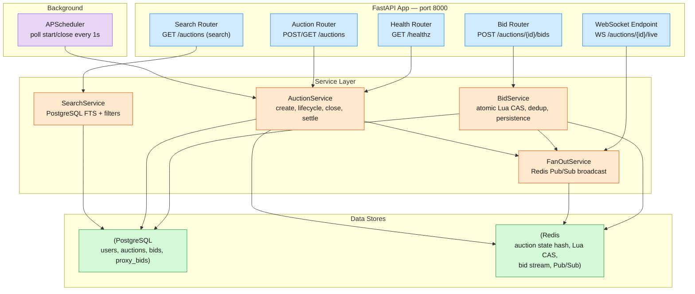

# Online Auction MVP — Design Specification

The engineering spec for a FastAPI + PostgreSQL + Redis online auction platform.
Produced from `docs/system-design.md` (the full target) and `docs/mvp-scope.md`
(the MVP cut). This is the implementable blueprint — no app code here; every
module below is built by downstream engineer cards.

---

## 1. Architecture Overview

Single FastAPI service (port 8000) with two backing stores and an in-process
scheduler. Routers are thin HTTP-parsing shells; services own all business logic,
Redis operations, and database access.



| Component | Role | Tech |
|-----------|------|------|
| FastAPI app | HTTP + WebSocket server | Python 3.12, uvicorn |
| PostgreSQL | Durable record of users, auctions, bids | asyncpg via SQLAlchemy 2.0 async |
| Redis | Hot-path bid kernel (atomic Lua CAS), state cache, Pub/Sub fanout, bid stream | redis-py async |
| APScheduler | Auction lifecycle driver (in-process, 1s poll) | apscheduler |

### MVP simplifications (from full target design)

| Full Design | MVP Replacement | Why |
|-------------|-----------------|-----|
| Kafka bid ordering | Redis Streams + direct HTTP | Single-node, no cross-partition coordination |
| Sharded inverted search index | PostgreSQL tsvector + GIN | MVP data volume fits in a single indexed table |
| Valkey sharded Pub/Sub | Redis Pub/Sub (single instance) | Single Redis node |
| ZSET scheduler + lease workers | APScheduler in-process | Single process |
| Full proxy resolution engine | Store-only proxy_max, no auto-counter-bid | Deferred to post-MVP phase |
| Settlement (Stripe + fencing token) | UPDATE winner_id, state=SOLD | Payment out of scope |

---

## 2. Data Model

### PostgreSQL tables

```sql
"user" {
  user_id      UUID PK DEFAULT gen_random_uuid()
  display_name TEXT NOT NULL
  email        TEXT UNIQUE NOT NULL          ← no password hash (MVP)
  created_at   TIMESTAMPTZ DEFAULT now()
}

auction {
  auction_id     UUID PK DEFAULT gen_random_uuid()
  seller_id      UUID NOT NULL → "user"
  title          TEXT NOT NULL
  description    TEXT
  category       TEXT NOT NULL               ← FTS filter column
  starting_price DECIMAL(12,2) NOT NULL CHECK (> 0)
  reserve_price  DECIMAL(12,2)               ← NULL = no reserve
  min_increment  DECIMAL(12,2) NOT NULL DEFAULT 1.00
  start_ts       TIMESTAMPTZ NOT NULL
  end_ts         TIMESTAMPTZ NOT NULL
  state          TEXT NOT NULL DEFAULT 'UPCOMING'
                 -- UPCOMING | ACTIVE | CLOSED | SOLD | UNSOLD
  highest_bid    DECIMAL(12,2)               ← denormalised; source of truth = Redis
  winner_id      UUID → "user"               ← set at settlement
  created_at     TIMESTAMPTZ DEFAULT now()

  INDEX ix_auction_state (state)
  INDEX ix_auction_category (category)
  INDEX ix_auction_end_ts (end_ts)           ← scheduler poll
  -- auction_fts: tsvector GENERATED ALWAYS AS (
  --   to_tsvector('english', title || ' ' || coalesce(description, ''))
  -- ) STORED
  -- GIN index on auction_fts
}

bid {
  bid_id           UUID PK DEFAULT gen_random_uuid()
  auction_id       UUID NOT NULL → auction
  bidder_id        UUID NOT NULL → "user"
  amount           DECIMAL(12,2) NOT NULL
  is_proxy         BOOLEAN NOT NULL DEFAULT false
  sequence_num     INTEGER NOT NULL            ← HINCRBY in Redis Lua CAS
  status           TEXT NOT NULL DEFAULT 'ACCEPTED'
                   -- ACCEPTED | REJECTED
  rejection_reason TEXT                         ← BID_TOO_LOW | AUCTION_NOT_ACTIVE |
                                                   AUCTION_ENDED | SELF_OUTBID
  created_ts       TIMESTAMPTZ DEFAULT now()

  INDEX ix_bid_auction_seq (auction_id, sequence_num DESC)
  INDEX ix_bid_bidder (bidder_id)
  UNIQUE (auction_id, bidder_id, amount, created_ts)  ← soft dedup
}

proxy_bid {
  proxy_id   UUID PK DEFAULT gen_random_uuid()
  auction_id UUID NOT NULL → auction
  bidder_id  UUID NOT NULL → "user"
  max_bid    DECIMAL(12,2) NOT NULL
  active     BOOLEAN NOT NULL DEFAULT true
  entered_ts TIMESTAMPTZ DEFAULT now()

  UNIQUE (auction_id, bidder_id)              ← one proxy per bidder per auction
}
```

### Redis structures

```
auction:{id}  →  HASH
  state           "ACTIVE"
  highest_bid     "150.00"
  highest_bidder  "<uuid>"
  end_ts          "1719950000"     ← unix seconds
  sequence_num    "42"             ← HINCRBY
  extensions_used "2"
  min_increment   "1.00"
  start_ts        "1719900000"

auction:{id}:bids  →  STREAM
  Fields: bid_id, bidder_id, amount, is_proxy, client_ts
  Consumer group: bid_processor
  Purpose: ordered durable log before PostgreSQL write

bid_result:{bid_id}  →  STRING (NX, TTL=48h after auction close)
  "ACCEPTED" | "REJECTED:BID_TOO_LOW" | "REJECTED:AUCTION_NOT_ACTIVE" | ...
  Purpose: idempotency — same bid_id always returns cached result

fanout:auction:{id}  →  PUB/SUB channel
  Payload: {sequence_num, current_price, high_bidder_masked, end_ts}
  Pushed by FanOutService after every accepted bid
```

---

## 3. API Contracts

All endpoints return JSON. Errors use standard HTTP status codes with a `detail`
field. Bidder identity is carried via `X-User-ID` header (MVP: no auth middleware).

### `POST /users` — Register a user

- **Tier:** senior-engineer
- **Request:** `{"display_name": "Alice", "email": "alice@example.com"}`
- **`201`:** `{"user_id": "...", "display_name": "Alice", "email": "..."}`
- **`409`:** email already registered

### `POST /auctions` — Create an auction listing

- **Tier:** senior-engineer (router), staff-engineer (service)
- **Headers:** `X-User-ID: <seller_id>`
- **Request:**
  ```json
  {
    "title": "Vintage Watch",
    "description": "A 1960s Omega Seamaster",
    "category": "watches",
    "starting_price": 100.00,
    "reserve_price": 500.00,
    "min_increment": 10.00,
    "start_ts": "2026-07-03T12:00:00Z",
    "end_ts": "2026-07-10T12:00:00Z"
  }
  ```
- **`201`:** `{"auction_id": "...", "state": "UPCOMING", ...}`
- **`400`:** start_ts in past, end_ts <= start_ts, starting_price <= 0
- **`404`:** X-User-ID not found

### `GET /auctions/{id}` — View auction detail

- **Tier:** senior-engineer (router), staff-engineer (service — merges PG + Redis)
- **`200`:**
  ```json
  {
    "auction_id": "...", "title": "...", "category": "...",
    "starting_price": "100.00", "current_price": "150.00",
    "min_increment": "10.00", "bid_count": 5,
    "state": "ACTIVE", "start_ts": "...", "end_ts": "...",
    "time_remaining_seconds": 604740
  }
  ```
- **`404`:** auction not found
- **Detail field rules:** `current_price` = highest_bid from Redis (falls back to PG if Redis is cold). `bid_count` = COUNT of ACCEPTED bids from PG. `time_remaining_seconds` = max(0, end_ts - now).

### `GET /auctions/{id}/history` — Bid history (paginated)

- **Tier:** senior-engineer
- **Query:** `cursor` (integer sequence_num, optional), `limit` (default 50, max 100)
- **`200`:**
  ```json
  {
    "auction_id": "...",
    "bids": [
      {"bid_id": "...", "bidder_id": "...", "amount": "150.00",
       "sequence_num": 5, "created_ts": "..."}
    ],
    "next_cursor": 2
  }
  ```
  Sorted by sequence_num DESC (newest first). `next_cursor` is null when no more pages.
- **`404`:** auction not found

### `POST /auctions/{id}/bids` — Place a bid

- **Tier:** senior-engineer (router), staff-engineer (service — Lua CAS kernel)
- **Headers:** `X-User-ID: <bidder_id>`
- **Request:** `{"amount": 150.00}`
  (optional proxy: `{"amount": 110.00, "is_proxy": true, "proxy_max": 500.00}`)
- **`201`:**
  ```json
  {"bid_id": "...", "status": "ACCEPTED", "sequence_num": 5,
   "current_price": "150.00"}
  ```
- **`409`:** `{"status": "REJECTED", "reason": "BID_TOO_LOW", "current_price": "200.00"}`
- **`409`:** `{"status": "REJECTED", "reason": "AUCTION_NOT_ACTIVE"}`
- **`409`:** `{"status": "REJECTED", "reason": "AUCTION_ENDED"}`
- **`422`:** amount <= 0, malformed decimal, amount < starting_price on first bid
- **`404`:** auction not found

### `GET /auctions` — Search/filter auctions

- **Tier:** senior-engineer
- **Query:** `category`, `price_min`, `price_max`, `q` (FTS keyword),
  `state` (default ACTIVE), `cursor` (base64 page token), `limit` (default 20, max 100)
- **`200`:**
  ```json
  {"auctions": [...], "next_cursor": "...", "total": 142}
  ```
  Cursor encodes `(created_at, auction_id)` for stable pagination.

### `WS /auctions/{id}/live` — Real-time bid updates

- **Tier:** senior-engineer
- **Protocol:** WebSocket, JSON text frames
- **On connect:** sends current state frame (HGETALL from Redis)
- **Per-bid frame:**
  ```json
  {"sequence_num": 6, "current_price": "160.00",
   "high_bidder_masked": "a3f2c1b9", "end_ts": "1719950060"}
  ```
- **Bidder masking:** first 8 chars of `SHA256(bidder_id)` as hex. If the
  connected user is the current high bidder, include `"is_you": true`.
- **Implementation:** Router opens a Redis Pub/Sub subscription to
  `fanout:auction:{id}`, forwards payloads to the WebSocket. Multiple clients
  per auction can connect; each gets its own Redis subscriber.

### `GET /healthz` — Liveness check

- **Tier:** senior-engineer
- **`200`:** `{"status": "ok"}`

---

## 4. Module / File Layout

```
src/auction_app/
├── __init__.py
├── main.py                      ← app factory, lifespan, /healthz     [staff]
├── config.py                    ← pydantic-settings                   [staff]
├── database.py                  ← async session/engine                [staff]
├── redis_client.py              ← async Redis pool, Lua registration [staff]
├── models/
│   ├── __init__.py
│   ├── user.py                  ← User ORM                            [staff]
│   ├── auction.py               ← Auction ORM + tsvector col          [staff]
│   ├── bid.py                   ← Bid ORM                             [staff]
│   └── proxy_bid.py             ← ProxyBid ORM                        [staff]
├── schemas/
│   ├── __init__.py
│   ├── user.py                  ← UserCreate, UserResponse            [senior]
│   ├── auction.py               ← AuctionCreate/Response/Detail       [senior]
│   ├── bid.py                   ← BidRequest, BidResponse, History    [senior]
│   └── search.py                ← SearchParams, SearchResult          [senior]
├── routers/
│   ├── __init__.py
│   ├── health.py                ← GET /healthz                        [senior]
│   ├── users.py                 ← POST /users                         [senior]
│   ├── auctions.py              ← CRUD + history                      [senior]
│   ├── bids.py                  ← POST /auctions/{id}/bids            [senior]
│   ├── search.py                ← GET /auctions (search)              [senior]
│   └── websocket.py             ← WS /auctions/{id}/live              [senior]
└── services/
    ├── __init__.py
    ├── auction_service.py       ← create, start, close, settle, get   [staff]
    ├── bid_service.py           ← place_bid (Lua CAS), history, dedup [staff]
    ├── fanout_service.py        ← Pub/Sub broadcast + masking         [senior]
    ├── search_service.py        ← PostgreSQL FTS query builder        [senior]
    └── scheduler_service.py     ← APScheduler lifecycle driver        [senior]
```

Supporting files (project root):

```
├── pyproject.toml               ← deps + dev extras                   [senior]
├── requirements.txt             ← runtime deps for Docker             [senior]
├── Dockerfile                   ← multi-stage, python:3.12-slim       [senior]
├── docker-compose.yml           ← db + redis + app, APP_PORT          [sre]
├── alembic.ini                                                     [senior]
├── alembic/
│   ├── env.py                                                    [staff]
│   └── versions/001_initial.py  ← schema DDL                       [staff]
├── .env.example                                                     [senior]
├── .gitignore                                                       [senior]
├── README.md                                                        [writer]
├── DEPLOY.md                                                        [sre]
├── tests/                        ← white-box (import auction_app)
│   ├── conftest.py                                                  [senior]
│   ├── test_auction_service.py                                      [senior]
│   ├── test_bid_service.py                                          [senior]
│   ├── test_fanout_service.py                                       [senior]
│   └── test_search_service.py                                       [senior]
└── verify/
    ├── manifest.env              ← e2e-verify contract               [senior]
    └── acceptance/
        ├── conftest.py           ← httpx client, user fixtures       [senior]
        ├── test_functional.py    ← FR1-3, FR5 + concurrency (existing) ⬅ PRESERVE
        ├── test_fr4_bid_history.py         ← FR4                     [architect]
        ├── test_fr6_winner_determination.py  ← FR6                   [architect]
        └── test_fr7_websocket_updates.py     ← FR7                   [architect]
```

---

## 5. Core Algorithm: Bid Placement (Redis Lua CAS)

The bid placement path is the consistency kernel. Every bid flows through an
atomic Lua script inside Redis — no database row locks, no optimistic retry loops.

### Execution flow

1. **Client → Router:** `POST /auctions/{id}/bids` with `X-User-ID` + `amount`
2. **Router → BidService.place_bid():**
   a. Generate `bid_id` (UUID v4)
   b. `XADD auction:{id}:bids` — durable log entry before CAS
   c. `EVAL place_bid.lua` with keys `[auction:{id}, bid_result:{bid_id}]`
      and args `[bid_id, bidder_id, amount, now_ts, dedup_ttl]`
   d. On ACCEPTED (status=1): INSERT into `bid` table with `sequence_num`,
      call `FanOutService.publish_bid_accepted()` which PUBLISHes to
      `fanout:auction:{id}`
   e. On REJECTED (status=0): INSERT into `bid` table with `status=REJECTED`
      and `rejection_reason`
   f. Return response to client

3. **WebSocket path:** FanOutService → Redis PUBLISH → websocket router
   (subscribed to `fanout:auction:{id}`) → JSON frame to connected clients

### What the Lua script guarantees

| Check | Enforced by |
|-------|-------------|
| Idempotency (same bid_id replayed) | `bid_result:{bid_id}` cached result |
| Auction is ACTIVE | `HGET state` check |
| Auction hasn't ended | `end_ts > now_ts` check |
| Bid > current_highest + min_increment | `amount >= current + min_inc` |
| Self-outbid prevention | `current_bidder != bidder_id or amount > current` |
| Anti-snipe extension | +60s when bid arrives in last 60s, max 5 extensions |
| Atomic state update | `HSET` + `HINCRBY` in same Lua execution |

The full Lua script (45 lines) is documented in `docs/system-design.md` § "Redis
Lua CAS Script." The `redis_client.py` module registers it at startup via
`SCRIPT LOAD` and stores the SHA for `EVALSHA` calls on the hot path.

### Concurrency model

Redis executes Lua scripts single-threaded — two simultaneous bids against the
same auction hash are serialized at the Redis event loop, not at the application
layer. This means:

- **No connection-pool saturation** (vs. `SELECT ... FOR UPDATE`)
- **No retry storms** (vs. optimistic version-column CAS)
- **Sub-millisecond per-bid latency** (in-Redis execution, no network round-trips)

The `bid_result:{bid_id}` dedup key is the safety net: if a bid's HTTP response
is lost but the CAS already executed, a retry of the same `bid_id` returns the
cached result instead of double-counting.

---

## 6. Auction Lifecycle

```
                    APScheduler
                   polls every 1s
  ┌──────────┐    ┌──────────────┐    ┌──────────────┐
  │ UPCOMING │───▶│    ACTIVE    │───▶│    CLOSED    │
  └──────────┘    └──────────────┘    └──────┬───────┘
       ▲              │      │               │
       │              │      │      ┌────────┴────────┐
       │              │      │      ▼                 ▼
       │              │      │  ┌──────┐         ┌────────┐
       │              │      └─▶│ SOLD │         │ UNSOLD │
       │              │         └──────┘         └────────┘
       │              │         (reserve met)    (reserve not met,
       │              │                           or no bids)
       │              │
   create_auction()   │
   sets state=UPCOMING│
                      │
            start_auction() called by
            scheduler when start_ts <= NOW()
            → initialises Redis hash
            → UPDATE state=ACTIVE in PG
```

| Transition | Trigger | Action |
|-----------|---------|--------|
| UPCOMING → ACTIVE | APScheduler: `start_ts <= NOW()` | `start_auction()`: initialise Redis hash, UPDATE PG state |
| ACTIVE → CLOSED | APScheduler: `end_ts <= NOW()` | `close_auction()`: read winner from Redis, UPDATE PG (state=CLOSED, winner_id, highest_bid) |
| CLOSED → SOLD | `resolve_settlement()` | Reserve price met (highest_bid >= reserve_price): UPDATE state=SOLD |
| CLOSED → UNSOLD | `resolve_settlement()` | Reserve not met or zero bids: UPDATE state=UNSOLD |

**Anti-snipe extension:** When a bid arrives with < 60s remaining, the Lua CAS
extends `end_ts` by 60s (max 5 extensions per auction). The scheduler's next
`end_ts <= NOW()` check is thus automatically pushed back.

**Cold-start recovery:** On process restart, `reconstruct_state()` rebuilds
the Redis hash for any ACTIVE auction whose Redis key is missing — reads the
highest accepted bid from PostgreSQL, resets `sequence_num` from the max
sequence in the bid table.

---

## 7. Key Design Decisions

### DD1: Redis Lua CAS vs. PostgreSQL locking for bid placement

**Chosen:** Redis Lua script as the single atomic bid kernel.

**Alternatives considered:**
- *PostgreSQL SELECT ... FOR UPDATE*: Row locks on the auction row serialise
  bids but cause connection-pool saturation under contention — each concurrent
  bidder holds a DB connection for the full lock duration.
- *Optimistic version-column CAS*: `UPDATE ... WHERE version = $old` with
  retry loops. Under high contention (500+ bids/sec), retry rates exceed 50%,
  wasting CPU and increasing tail latency.

**Why Redis Lua wins:** Single-threaded execution guarantees serial order
without locks or retries. Sub-millisecond latency. The dedup key
(`bid_result:{bid_id}`) prevents double-accept on replay — the safety net
that makes the durability trade-off acceptable.

### DD2: Redis Streams vs. Kafka for bid ordering

**Chosen:** Redis Streams (XADD / XREADGROUP) for MVP.

**Alternative:** Kafka — the full design's approach.

**Why Streams:** At MVP scale (single node), Redis Streams provide ordered,
persistent, consumer-group-based delivery without a Kafka cluster's operational
overhead. The bid ordering guarantee comes from Redis's single-thread event loop
(XADD → EVAL, same connection). Consumer groups + ACK give at-least-once
semantics. If this graduates to production, swapping Redis Streams for Kafka is
a transport swap — the service interface stays the same.

### DD3: In-process APScheduler vs. external scheduler

**Chosen:** APScheduler in FastAPI lifespan, 1s poll interval.

**Alternative:** Separate worker with Redis ZSET + lease-based failover
(the full design's approach for 10M concurrent auctions).

**Why in-process:** At MVP scale (hundreds–low thousands of auctions), a 1s
poll handles the load trivially. On crash, overdue ACTIVE auctions are picked
up on restart. No multi-process lease coordination needed.

### DD4: Store-only proxy bidding (no auto-counter-bid)

**Chosen:** Save proxy_max in proxy_bid table; do NOT auto-counter-bid.

**Alternative:** Full proxy resolution engine — load all active proxies into
memory, sort by `(max_bid DESC, entered_ts ASC)`, resolve winner in a single CAS.

**Why store-only:** The MVP's priority is the core bid kernel (atomic CAS,
dedup, anti-snipe). Auto-counter-bidding adds N-proxy resolution complexity.
Storing proxy_max means the data model is forward-compatible; the resolution
engine can be added without a migration.

### DD5: PostgreSQL FTS vs. dedicated search index

**Chosen:** PostgreSQL tsvector generated column + GIN index.

**Alternative:** Elasticsearch / sharded inverted index (full design).

**Why PG FTS:** At MVP scale, a GIN-indexed tsvector column provides ranked
FTS, category filtering, and price range filtering in a single parameterized
query. No separate index pipeline. The GENERATED ALWAYS column auto-updates
on INSERT/UPDATE.

---

## 8. Implementation Tier Map

Tiers route work to the right engineer profile. Default is **senior-engineer**;
reserve **staff-engineer** for core algorithms, data model, and correctness-
critical paths.

| File / Task | Tier | Rationale |
|-------------|------|-----------|
| `src/auction_app/main.py` | staff | App factory, lifespan, scheduler wiring |
| `src/auction_app/config.py` | staff | Typed settings, env validation |
| `src/auction_app/database.py` | staff | Async session/engine, migration runner |
| `src/auction_app/redis_client.py` | staff | Async pool, Lua script SCRIPT LOAD, health |
| `src/auction_app/models/*` (4 files) | staff | ORM with correct indexes, tsvector, constraints |
| `src/auction_app/schemas/*` (4 files) | senior | Pydantic DTOs — straightforward |
| `src/auction_app/routers/*` (6 files) | senior | Thin HTTP layer — parse, call service, serialise |
| `src/auction_app/services/auction_service.py` | staff | Lifecycle transitions, settlement — correctness-critical |
| `src/auction_app/services/bid_service.py` | staff | Lua CAS kernel, dedup, persistence — core algorithm |
| `src/auction_app/services/fanout_service.py` | senior | Pub/Sub broadcast, SHA256 masking |
| `src/auction_app/services/search_service.py` | senior | Parameterised SQL with FTS |
| `src/auction_app/services/scheduler_service.py` | senior | APScheduler integration, polling loop |
| `alembic/env.py` + migration | staff | Schema DDL — correct constraints, indexes, tsvector |
| `pyproject.toml`, `requirements.txt` | senior | Dependency declaration |
| `Dockerfile` (multi-stage) | senior | Python 3.12 slim, venv pattern |
| `docker-compose.yml` | sre | Compose orchestration: db+redis+app, healthchecks |
| `.env.example`, `.gitignore` | senior | Config docs, repo hygiene |
| `tests/` (white-box, 4+ test files) | senior | Unit + integration tests for services |
| `verify/manifest.env` | senior | e2e contract wiring |
| `verify/acceptance/test_functional.py` | senior | Existing black-box suite — PRESERVE |
| `verify/acceptance/test_fr4_bid_history.py` | architect | New FR4 acceptance case |
| `verify/acceptance/test_fr6_winner_determination.py` | architect | New FR6 acceptance case |
| `verify/acceptance/test_fr7_websocket_updates.py` | architect | New FR7 acceptance case |
| `README.md`, `DEPLOY.md` | writer / sre | User-facing docs |

---

## 9. Acceptance Test Map

One black-box test case per functional requirement. Each test hits the running
system over HTTP/WebSocket; zero app imports.

| FR | Requirement | Test file | Status |
|----|-------------|-----------|--------|
| FR1 | Create auction — 201, state, validation | `test_functional.py` | ✅ Existing |
| FR2 | Place bid — higher accepted, lower rejected, dedup | `test_functional.py` | ✅ Existing |
| FR3 | View auction — metadata, current_price, bid_count | `test_functional.py` | ✅ Existing |
| FR4 | Bid history — paginated, newest-first, cursor | `test_fr4_bid_history.py` | 🆕 |
| FR5 | Auction lifecycle — UPCOMING→ACTIVE→CLOSED | `test_functional.py` | ✅ Existing |
| FR6 | Winner determination — winner_id set after close | `test_fr6_winner_determination.py` | 🆕 |
| FR7 | WebSocket updates — connect, receive bid frames | `test_fr7_websocket_updates.py` | 🆕 |
| — | Concurrency — two simultaneous bids, higher wins | `test_functional.py` | ✅ Existing |

### Evidence gate

The host `e2e-verify` loop runs the full suite against the live stack:
```bash
API_BASE_URL=http://localhost:8010 pytest -v verify/acceptance/
```

The architect's deliverable is the design above + the three new acceptance
files. The engineer and verifier cards that follow will make these pass.
